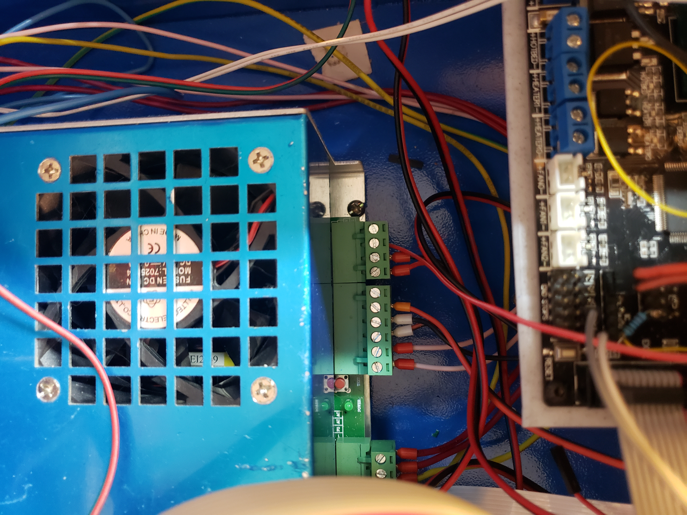
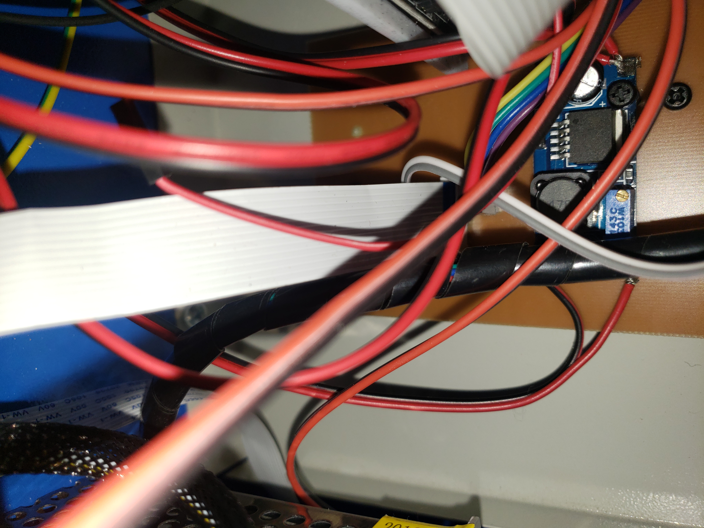
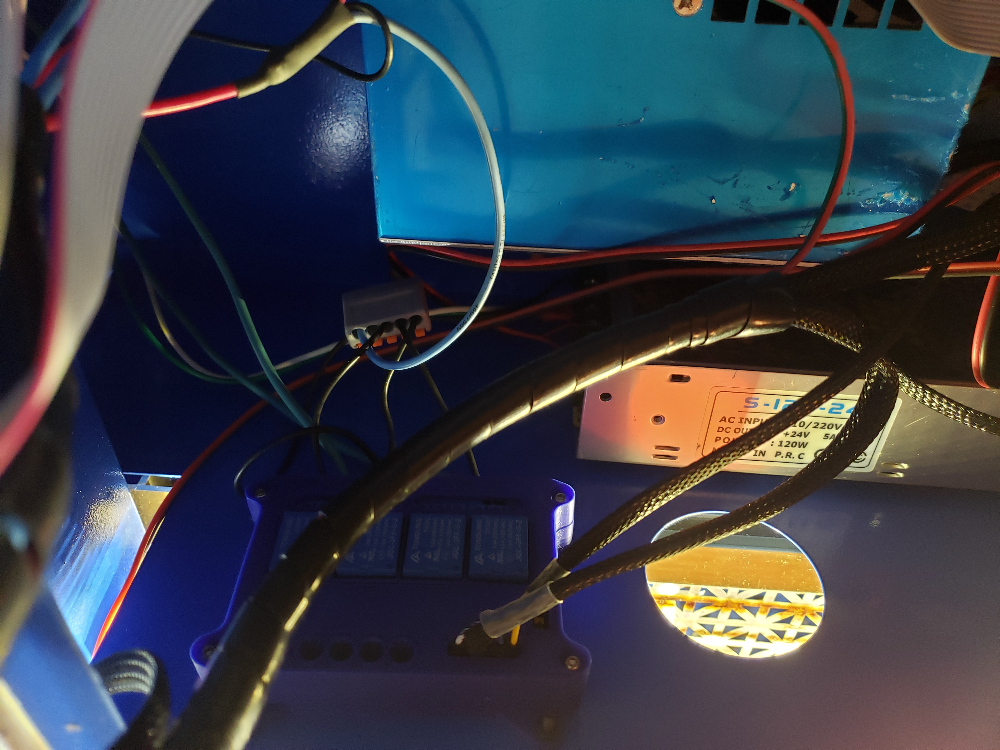
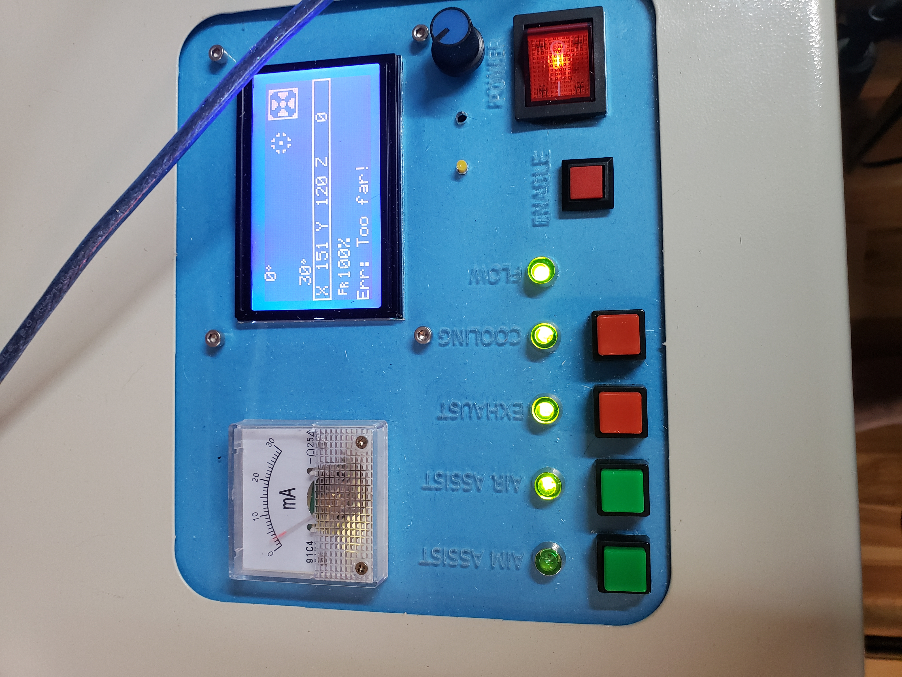
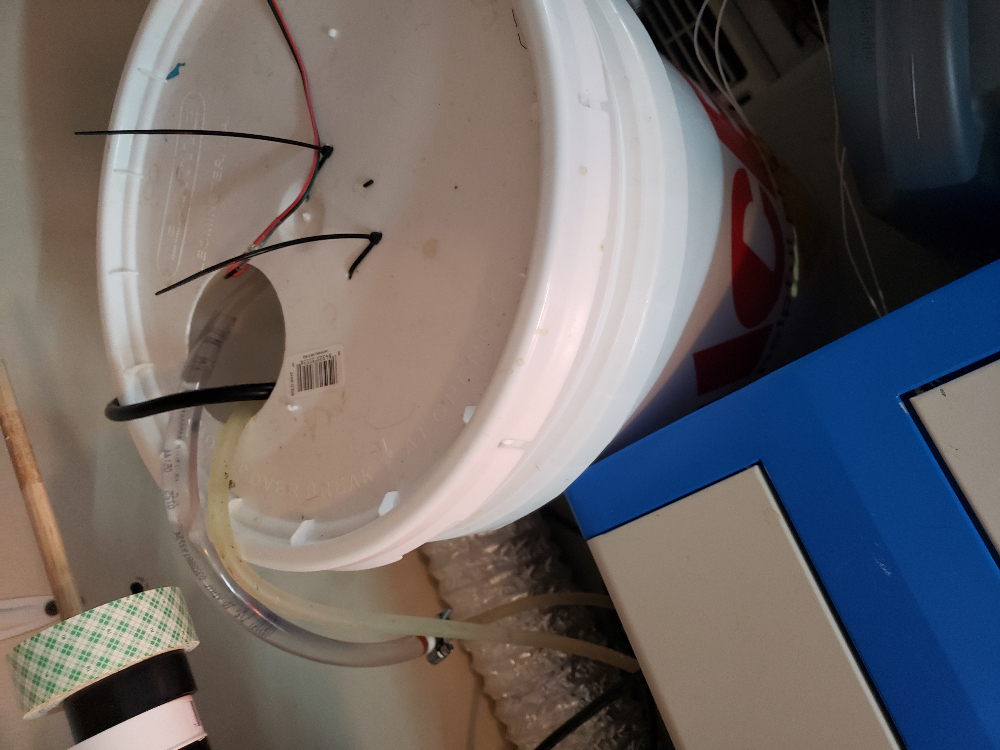

https://github.com/adam-p/markdown-here/wiki/Markdown-Cheatsheet#hr

# Making the K40 not suck, a simple plan.

## WARNINGS:
1. This is not going to go into modifying a RAMPS board to support 24V. 
   * If you're brave enough to try this, then use this [link](https://github.com/ExplodingLemur/presentations/wiki/K40-RAMPS-Conversion) to follow his instructions on modifying the board
2. An ability to either solder or spare cash to purchase parts.

# Results for just ramps, no stepper upgrade:

## Materials:

### Note on Materials: The initial write-up here is going to be just for RAMPS, then I'm going to add the stuff for my enclosure for exhaust/cooling/air assist, and then come back and add an addendum for using the LPC1768 board for Raster.

* RAMPS 1.4(Trigorilla or other **24V friendly**) *** MKS Board Sgen L V1
* K40 Breakout or skills 
  * https://oshpark.com/shared_projects/3W1BpcNl 
  * $15USD at https://awesome.tech/product/k40-middlemen-board/
  * BRD and SCH files included below for slim version
  * Connector part is linked from [this](https://github.com/ExplodingLemur/presentations/wiki/K40-RAMPS-Conversion) site, search for "connector for the cable"
* 4 Relay board **
* 5V laser diode **
* 3D Printer
* 24V PSU(Or run relay?) **
* 2A stepper for X(At least)

---
Goal: Make K40 not suck.

Inspiration/Source: http://3dprintzothar.blogspot.com/2014/08/40-watt-chinese-co2-laser-upgrade-with.html

## Breakout wiring
#### Note the Buck converter in this picture is used for something else later on.
These are difficult to see, but on my home-made K40 breakout we have:

|Wire Color| Purpose| Pin|
|-------------|-------------------|---|
|Red| 5V on RAMPS| Any available 5V|
|Black| GND on Ramps| Any available GND|
|4 Pin Dupont| X stepper|X motor|
|White| X Endstop| X- Signal|
|Grey| Y Endstop| Y- Signal|

Use this link to download the Eagle BRD file [Board File](media/k40_breakout/K40_MiddleMan_002A.brd)  
Use this link to download the Eagle SCH file [Board Schematic](media/k40_beakout/K40_MiddleMan_002A.sch)

## Board mount
I used [This thing](https://www.thingiverse.com/thing:2155376) to mount the Trigorilla board in my case. You can find others that will work for whatever RAMPS variant you have. The inpiration link above I think has one for a regule RAMPS even.

## Wiring RAMPS to Laser PSU
PSU Wiring:
#### Note that you may need to check the pinout on your PSU

Top connector(top to bottom)
* NC
* 5V going to any open 5V pin on RAMPS
* GND going to - of 5A input on RAMPS
* +24V going to + of 5A input on RAMPS
---
Bottom Connector(top to bottom)
* NC
* Laser PWM - 6 -- There are only certain pins this can go on because of timers. Leave it on 6 to be safe.
* GND going to any open - on RAMPS
* Laser Enable/Fire - 5 - This is just a digital IO so you can use whichever you want - 10K resistor to +5V here to stop sporadic turnon during boot if interlock is off
* One side of enable push-button toggle
* Other side of enable push-button toggle
---

### 12V buck for Relays
Stepping 24V down to 5V to run switches and the relay coils

### Relay board

Runs: Cooling(water pump), Exhaust, and Air Assist via panel buttons

### Panel

Pretty basic in the grand scheme

### Water pump/flow indicator?

Inline with the water pump's outlet I have a 12V generator that turns JUST enough to power on the green "FLOW" led.

## MKS Upgrade for Raster